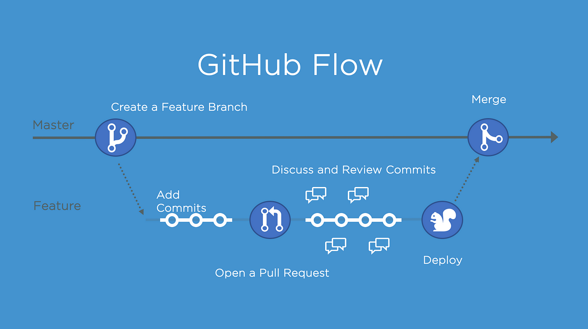

### Github-Action-CICD
<h3 align="center">Bài tập thực hành Github action CI/CD </h3>

 

### 📒Kĩ năng áp dụng trong Project :

  
  
  

### 📒Yêu cầu Project :

  Biết được cách sử dụng tool CI/CD như Github Action.

### 😍Trình bày về project:

  Sơ đồ mô phỏng về quá trình:

  - Flow thực hiện quá trình CI/CD một cách tự động từ build code, tự động hóa, deploy

